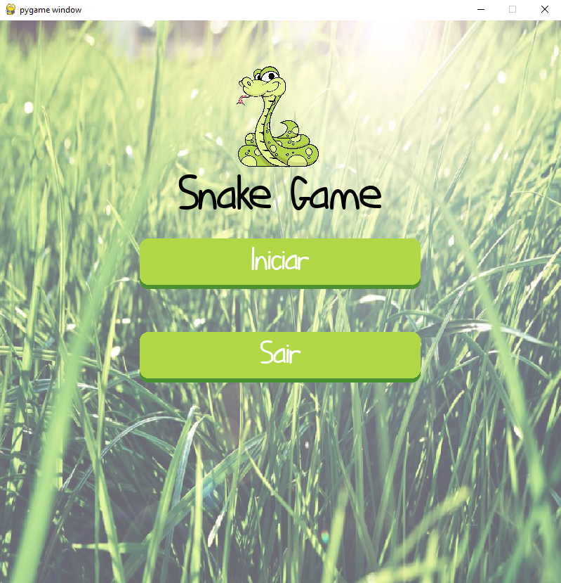

<h1 align="center">Snake Game</h1>

Jogo da cobrinha desenvolvido com python e pygame.

<p align="center">
    
</p>

---

## Install

Install plugin pygame with running:

```bash
pip install -r requirements.txt
```

---

## Run

navigate to directory where find the main.py file and run in terminal:

```bash
python main.py
```
